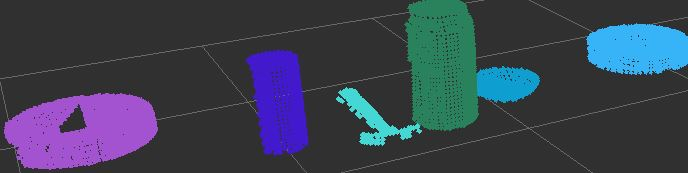
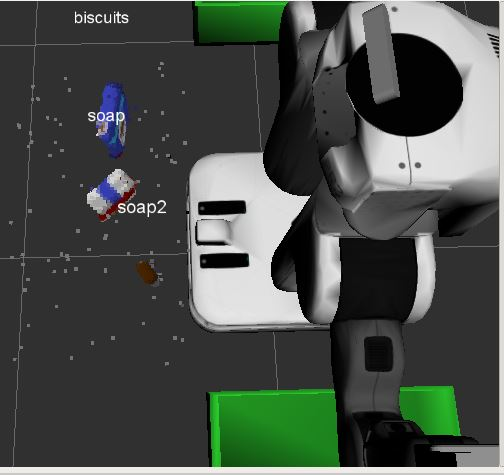

# Project: Perception Pick & Place
## Exercises 1, 2 and 3
### 1. Exercise 1: filtering and segmentation.

#### Voxel Grid Downsampling
By tryig different `LEAF_SIZE` values, I have found that 0.01 was the best size for a voxel. A size of 0.001 was too small, while 0.1 and 1 were too big.


#### PassThrough filter
To filter the cloud and only getting the point cloud for the table and the objects, I have found that filtering from z_min=0.6 to z_max=1.1 using a Pass Through filter was very good values.

#### RANSAC plane segmentation
Using a RANSAC plane segmentation to segment the table and extract its point cloud was pretty well achieved with a `max_distance` of 0.01 m.

#### Another PassThrough filter
After the table segmentation, and extracting the inliers and the outliers, I have found that the edge of the table was not segmented. So I have added another Pass Through filter along y axis with y_min=-2.5 and y_max=-1.4.


### 2. Exercise 2: clustering for segmentation.
Five trials were made in order to produce a good clustering using Euclidean Cluster Extraction.

--------------

ClusterTolerance=0.1, MinClusterSize=10, MaxClusterSize=2000

result: 4 objects detected.


The hammer, the soda_can and the bowl were considered as only one object. So I reduced the tolerance and the maximum size.

--------------

ClusterTolerance=0.01, MinClusterSize=10, MaxClusterSize=1500

result: 36 objects detected.


Ofcourse this happens due to the very small tolerance value of 0.01.

--------------

ClusterTolerance=0.08, MinClusterSize=10, MaxClusterSize=1500

result: 5 objects detected.


The soda_can and the bowl still considered as only one object. Decreasing maximum size and tolerance may help with this. 

--------------

ClusterTolerance=0.07, MinClusterSize=10, MaxClusterSize=1300

result: 4 objects detected.


Now the sode can and bowl are gone. The maximum size of 1300 is less than size(soda_can) + size(bowl). So the maximum size is good, but the tolerance should be decreased more.

--------------

ClusterTolerance=0.05, MinClusterSize=10, MaxClusterSize=1300

result: 6 objects detected.



And now we can say that we have found an adequate solution for the parameter values.

--------------

### 3. Exercise 3:  Features Extraction, SVM Training and Object Recognition.

#### Features Extraction:-
In order to extract a good feature set, I have used 16 bins histograms for both color and normal features in `features.py`. I have also used the HSV color space to further enhance features extraction by passing `using_hsv=True` to `compute_color_histograms()` function in `capture_features.py` and `object_recognition.py`.

#### SVM Training:-
After running the `train_svm.py` script, the results were good enough to move to the next step, object recognition.


#### Object Recognition:-
Implementing the `object_reognition.py` script was straightforward. The code was mostly written as illustated in the previous lessons. Then proceeding with Exercise-3 TODOs by using `pcl_to_ros()` helper function to convert the cluster from pcl to ROS, and using the code provided in `capture_features.py` to extract the histogram features.

At the end of the `object_reognition.py` script, I have initialized the ROS node, created the subscribers and publishers and loaded the model.

Running the object recognition node produced a pretty good recognition job.


--------------

## Pick and Place Setup

### Perception Pipeline:-
The same code written in Exercises 1 and 2 was used in the project except for adding the Statistical Outlier filter at the beginning and a new Pass Through filter is added to filter out the corners of the red and green boxes from the cloud. This new filter was along y axis ranging from -0.5 to 0.5 m.

The parameters of the Statistical Outlier filter were adjusted in the following sequence:-

--------------

mean_k=50, threshold_scale_factor=0.1



--------------

mean_k=100, threshold_scale_factor=1


Here the objects was not even detected.

--------------

mean_k=10, threshold_scale_factor=0.001


--------------

### Features Extraction, Training and Object Recognition:-
As done previously in Exercise 3, I have extracted the features for each pick list provided in the `pick_list_*.yaml` file simply by modifying the `models` list in the `capture_features.py` script with the pick list provided in the `pick_list_*.yaml` file.

for `pick_list_1.yaml` :-
```
 models = [\
     'biscuits',
     'soap',
     'soap2']
```

for `pick_list_2.yaml` :-
```
 models = [\
     'biscuits',
     'book',
     'glue',
     'soap',
     'soap2']
```

for `pick_list_3.yaml` :-
```
 models = [\
     'biscuits',
     'book',
     'eraser',
     'glue',
     'snacks',
     'soap',
     'soap2',
     'sticky_notes']

```

------------

After that I have trained the SVM and tested the object recognition node in Rviz.


------------


------------


------------

### Implementing `pr2_mover()` function and output to `.yaml` file

Initializing the variables, reading the `pick_list_*.yaml` file and populating `labels` and `centroids` lists are straightforward as illustrated in output yaml files section.

the `test_scene_num.data` depends on the yaml file, or in other words we can also say it depends on the length of the pick list read from yaml file. I have also assigned a file name for the output yaml file.
```
	# populate variables
	# test_scene_num
	lengthOfYamlList = len(object_list_param)
	if(lengthOfYamlList == 3):
		test_scene_num.data = 1
		yaml_filename = 'output_1.yaml'
	elif(lengthOfYamlList == 5):
		test_scene_num.data = 2
		yaml_filename = 'output_2.yaml'
	else:
		test_scene_num.data = 3
		yaml_filename = 'output_3.yaml'
```

And for each object in the detected objects list, I have checked to which object in the pick_list yaml file this detected object corresponds using a variable called `objectIndex`. Thus we are able to assign a value to `object_name.data` and `arm_name.data`.
```
		# check to which object in the pick_list yaml file this detected object corresponds
		objectIndex = -1
		for j in range( len(object_name_list) ):
			if(labels[i] == object_name_list[j]):	# if this ith detected object has the same name
				objectIndex = j
				break
		# object_name
		object_name.data = object_name_list[objectIndex]

		# arm_name
		objectGroup = 'green'
		if object_group_list[objectIndex] == 'green':
			objectGroup = 'green'
			arm_name.data = 'right'
		else:
			objectGroup = 'red'
			arm_name.data = 'left'
``` 
pick_pose (position data) are given from the centroids list.
```
		pick_pose.position.x = centroids[i][0]
		pick_pose.position.y = centroids[i][1]
		pick_pose.position.z = centroids[i][2]
```
pick_pose (orientation data) are set to 0.0

And the last variable which is place_pose is asigned with the values given from the dropbox parameter.
```
		dropbox_param = rospy.get_param('/dropbox')
		if objectGroup == 'green':
			place_pose.position.x = dropbox_param[1]['position'][0]
			place_pose.position.y = dropbox_param[1]['position'][1]
			place_pose.position.z = dropbox_param[1]['position'][2]
			place_pose.orientation.x = 0.0
			place_pose.orientation.y = 0.0
			place_pose.orientation.z = 0.0
			place_pose.orientation.w = 0.0
		else:
			place_pose.position.x = dropbox_param[0]['position'][0]
			place_pose.position.y = dropbox_param[0]['position'][1]
			place_pose.position.z = dropbox_param[0]['position'][2]
			place_pose.orientation.x = 0.0
			place_pose.orientation.y = 0.0
			place_pose.orientation.z = 0.0
			place_pose.orientation.w = 0.0
```

At the end of the `project_template.py` script, I have initialized the ROS node, created the subscribers and publishers and loaded the `model.sav` file.


